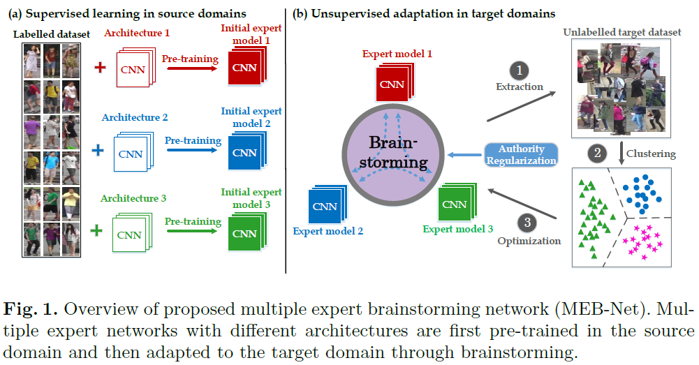
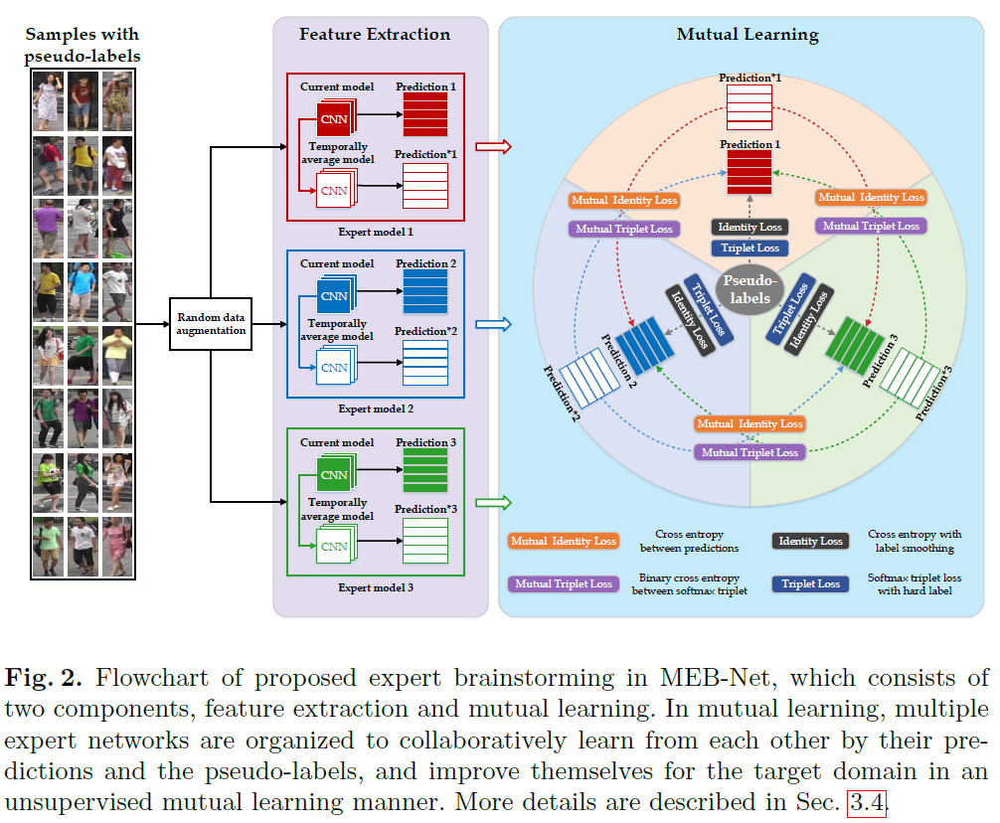
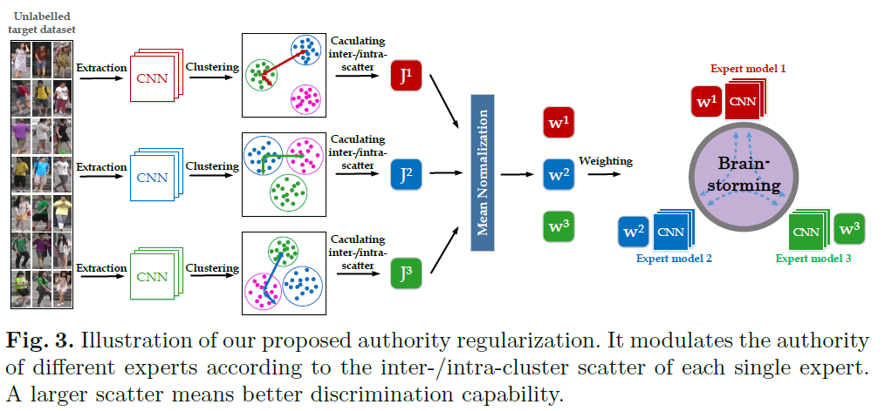
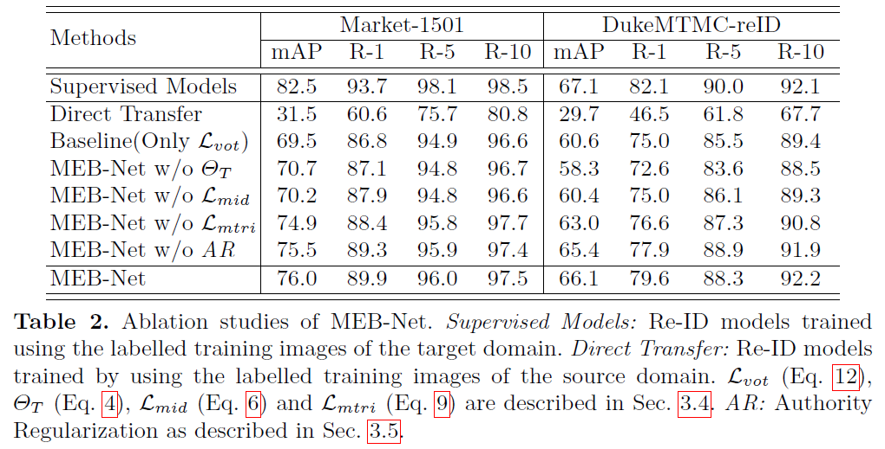
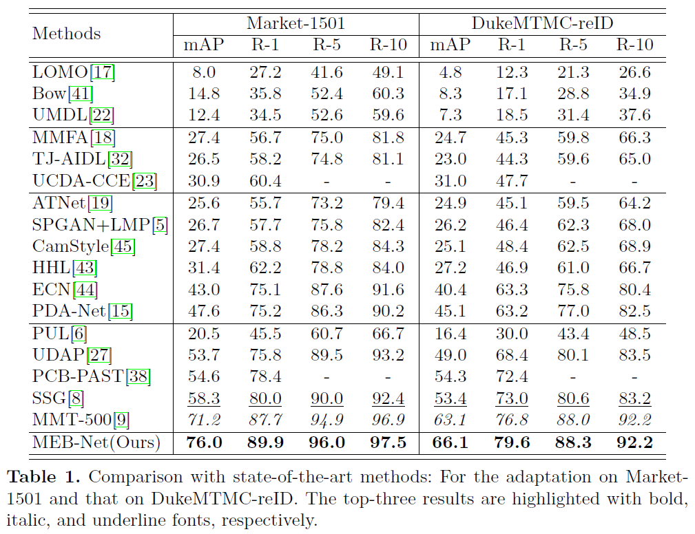

# Multiple Expert Brainstorm Network

Yunpeng Zhai, Qixiang Ye, Shijian Lu, Mengxi Jia, Rongrong Ji, Yonghong Tian. "Multiple Expert Brainstorming for Domain Adaptive Person Re-identification", ECCV 2020

<!--  -->



<!--  -->


<!--  -->

## Setup

Datasets (Market-1501 and DukeMTMC-reID).

## Requirements

- PyTorch 1.3.1

## Running the experiments

### Step:1 Supervised learning in the source domain

```
bash pretrain.sh <source dataset> <target dataset> <architecture>
```
For example, (duke->market):
```
bash pretrain.sh dukemtmc market1501 densenet
bash pretrain.sh dukemtmc market1501 resnet50
bash pretrain.sh dukemtmc market1501 inceptionv3
```

### Step:2 Unsupervised adaptation in the target domain

```
bash train.sh <source dataset> <target dataset> <architecture-1> <architecture-2> <architecture-3>
```
For example, (duke->market)
```
bash train.sh dukemtmc market1501 densenet resnet50 inceptionv3
```

### Step:3 Evaluate in the target domain

```
bash test.sh <target dataset> <architecture> <checkpoint_path>
```
For example, (market1501, densenet)
```
bash test.sh market1501 densenet logs/xxxx/xxxx-MEB-Net/checkpoint.pt.pth
```

## Experiment results



<!-- | Src -> Tgt Dataset     | mAP | Rank-1 | Rank-5 | Rank-10 | 
| :-------------------:  | :-------: | :-------------: |  :--------------:| :-------------: |
| DukeMTMC -> Market1501 | 76.0    | 89.9              | 96.0              | 97.5            | 
| Market1501 -> DukeMTMC | 66.1    | 79.6              | 88.3              | 92.2            |  -->

## Acknowledgement

Our code is based on [open-reid](https://github.com/Cysu/open-reid) and [MMT](https://github.com/yxgeee/MMT).
